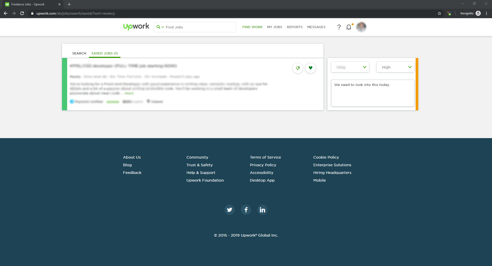

# upwork-chrome-extension
The extension is designed to simplify the work of the sales department.
The essence of the extension is that users are able to make marks in the form,
which are displayed in real time for all active users.



## Build Setup

``` bash
# install dependencies
npm install

# hot reload
npm run watch

# dev build without minification
npm run build:dev

# build for production with minification
npm run build
```

## Data in forms
To change the options in the drop-down lists,
you have to edit the `src/content/selectsData.json` file
and rebuild the extension with the command `npm run build`.

## Installation
* Open the extension page - [chrome://extensions/](chrome://extensions/).
* Turn on the **Developer mode** switch in the upper right corner.
* Click the **Load unpacked** button in the upper left corner and specify the path to the **dist** folder.